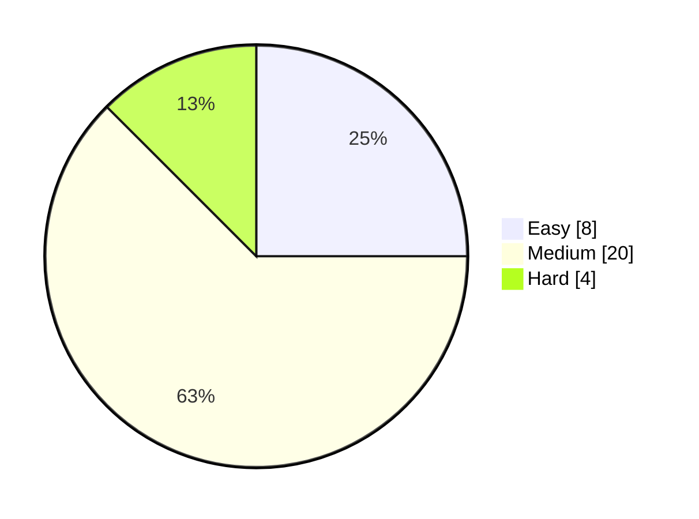

# Hey there, I'm Anjali! 👋

LeetCode efficient solutions using C++ language.

## 📊 LeetCode Progress Graph

*(Update the numbers above when you track your solved questions.)*

## Contact Info

* [LeetCode](https://leetcode.com/u/anjali_verma09)
* [GitHub](https://github.com/Anjaliverma09/)
* [LinkedIn](https://www.linkedin.com/in/anjali-verma09/)

## 🛠 Tools & Platforms

* VS Code
* IntelliJ
* Git & GitHub
